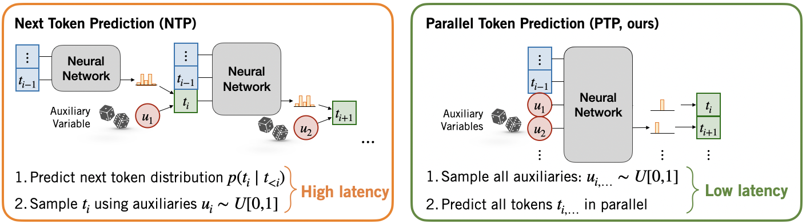

# Parallel Token Prediction for Language Models (ICLR 2026)

Felix Draxler*, Justus Will*, Farrin Marouf Sofian, Theofanis Karaletsos, Sameer Singh, Stephan Mandt

## Introduction



Parallel Token Prediction (PTP) predicts consistent sequences of tokens in one transformer call. It does so by moving the randomness involved in sampling autoregressive models into the input of the model. This makes the prediction of several tokens a unique function.


## Installation

```bash
git clone https://github.com/mandt-lab/ptp
cd ptp
uv sync
source .venv/bin/activate
```

## Training

### Make your model parallel

Run the following command to setup an experiment directory:

```bash
ptp_distill model_name dataset_name
```

- `model_name`: Anything that works with HuggingFace `transformer.AutoModelForCausalLM.from_pretrained(model_name)`
- `dataset_name`: Anything that can be loaded with HuggingFace `datasets.load_dataset(dataset_name)`

The command will then setup an experiment config according interactively.

The main choice is how to treat the training data. In the paper, we train on completions by the base model, so we first need to generate them from prompts in the dataset. The code also supports directly on training sequences, without consulting the model. This gives you results faster; training on base model completions probably results in larger inference speedup.

After completing the setup, use `ptp_pregenerate` to sample base model completions to train on (optional), and `ptp_train` to train your PTP model.


### Replicate our experiments

1. Pregenerate teacher completions:
   ```bash
   ptp_pregenerate paper-checkpoints/[experiment-name]
   ```
2. Train with:
   ```bash
   ptp_train paper-checkpoints/[experiment-name]
   ```

Here, `experiment-name` is a directory in the `paper-checkpoints` folder:

We are currently working on releasing our model weights.


## Inference using Partial Quadratic Decoding

For fast inference using Partial Quadratic Decoding, use this demo script:
```bash
ptp_generate [experiment-directory]
```
It responds like a chatbot, reporting how many tokens each model call generated, roughly corresponding to the speedup compared to next-token prediction.


## Citation

```bibtex
@inproceedings{
  draxler2026parallel,
  title={Parallel Token Prediction for  Language Models},
  author={Felix Draxler and Justus Will and Farrin Marouf Sofian and Theofanis Karaletsos and Sameer Singh and Stephan Mandt},
  booktitle={The Fourteenth International Conference on Learning Representations},
  year={2026},
  url={https://openreview.net/forum?id=AGJomYSrUG}
}
```
